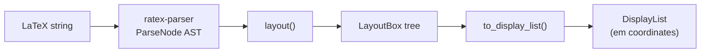

`ratex-layout` takes a `ParseNode` AST produced by `ratex-parser` and emits a flat [`DisplayList`](/api/crates/ratex-types#displaylist) of drawing commands with absolute coordinates in em units.

```toml Cargo.toml
[dependencies]
ratex-layout = "0.0.15"
```

**Public exports:**

```rust
pub use engine::layout;
pub use layout_options::LayoutOptions;
pub use layout_box::LayoutBox;
pub use to_display::to_display_list;
```

---

## Layout pipeline



The pipeline runs in two passes:

1. **`layout(&ast, &opts)`** — recursively converts the `ParseNode` AST into a `LayoutBox` tree. Each box carries its `width`, `height`, `depth` (all in em units), a `BoxContent` variant describing its kind, and a `Color`. This pass resolves font metrics, fraction shifts, script positions, radical sizing, delimiter stretching, and all TeX spacing rules.

2. **`to_display_list(&layout_box)`** — walks the `LayoutBox` tree top-down, accumulating absolute positions, and emits a flat `Vec<DisplayItem>`. The result is a `DisplayList` that renderers can iterate without any further layout knowledge.

---

## Functions

### `layout`

Convert a parsed AST into a `LayoutBox` tree.

```rust
pub fn layout(nodes: &[ParseNode], opts: &LayoutOptions) -> LayoutBox
```

<ParamField path="param.nodes" type="&[ParseNode]" required>
  Slice of parse nodes from `ratex_parser::parse()`.
</ParamField>

<ParamField path="param.opts" type="&LayoutOptions" required>
  Layout configuration. Use `LayoutOptions::default()` for standard display-mode rendering.
</ParamField>

**Returns:** The root `LayoutBox` for the entire expression.

---

### `to_display_list`

Flatten a `LayoutBox` tree into a `DisplayList` with absolute coordinates.

```rust
pub fn to_display_list(root: &LayoutBox) -> DisplayList
```

<ParamField path="param.root" type="&LayoutBox" required>
  Root layout box returned by `layout()`.
</ParamField>

**Returns:** A `DisplayList` ready for rendering. All coordinates are in em units.

---

## `LayoutOptions`

Configuration passed through the layout tree.

```rust
#[derive(Debug, Clone)]
pub struct LayoutOptions {
    pub style: MathStyle,
    pub color: Color,
    pub align_relation_spacing: Option<f64>,
    pub leftright_delim_height: Option<f64>,
    pub inter_glyph_kern_em: f64,
}
```

<ResponseField name="style" type="MathStyle" default="MathStyle::Display">
  Initial math style for the expression. Controls sizing of sub-expressions. See [`MathStyle`](/api/crates/ratex-types#mathstyle).
</ResponseField>

<ResponseField name="color" type="Color" default="Color::BLACK">
  Default ink color for all glyphs and lines. Overridden by `\color{}` commands within the expression.
</ResponseField>

<ResponseField name="align_relation_spacing" type="Option<f64>" default="None">
  When set (e.g. inside `align`/`aligned` environments), caps relation spacing to this many mu for column alignment consistency.
</ResponseField>

<ResponseField name="leftright_delim_height" type="Option<f64>" default="None">
  Inside `\left`…`\right`, the stretch height for `\middle` delimiters (second-pass only).
</ResponseField>

<ResponseField name="inter_glyph_kern_em" type="f64" default="0.0">
  Extra horizontal kern between glyphs in em units. Used by `\url`/`\href` to match browser letter-spacing.
</ResponseField>

**Builder methods:**

```rust
let opts = LayoutOptions::default()
    .with_style(MathStyle::Text)
    .with_color(Color::rgb(0.5, 0.0, 0.0))
    .with_inter_glyph_kern(0.02);
```

---

## `LayoutBox`

The fundamental unit of layout. Every mathematical element is represented as a box with three dimensions, all in em units relative to the current font size.

```rust
#[derive(Debug, Clone)]
pub struct LayoutBox {
    pub width: f64,
    pub height: f64,   // ascent above baseline
    pub depth: f64,    // descent below baseline
    pub content: BoxContent,
    pub color: Color,
}
```

`LayoutBox` is an intermediate type — it is produced by `layout()` and consumed by `to_display_list()`. Callers building renderers or custom pipeline stages may inspect it, but most integrations work exclusively with the resulting `DisplayList`.

### `BoxContent` variants

<AccordionGroup>
  <Accordion title="HBox — horizontal list">
    A list of child boxes laid out left-to-right.

    ```rust
    BoxContent::HBox(Vec<LayoutBox>)
    ```
  </Accordion>
  <Accordion title="VBox — vertical list">
    A list of children laid out top-to-bottom, optionally with kern gaps.

    ```rust
    BoxContent::VBox(Vec<VBoxChild>)
    // VBoxChild { kind: Box(LayoutBox) | Kern(f64), shift: f64 }
    ```
  </Accordion>
  <Accordion title="Glyph — single character">
    A single glyph from a KaTeX font.

    ```rust
    BoxContent::Glyph { font_id: FontId, char_code: u32 }
    ```
  </Accordion>
  <Accordion title="Fraction — numerator over denominator">
    A fraction with an optional bar.

    ```rust
    BoxContent::Fraction {
        numer: Box<LayoutBox>, denom: Box<LayoutBox>,
        numer_shift: f64, denom_shift: f64,
        bar_thickness: f64,
        numer_scale: f64, denom_scale: f64,
    }
    ```
  </Accordion>
  <Accordion title="SupSub — superscript and subscript">
    A base with optional superscript and/or subscript.

    ```rust
    BoxContent::SupSub {
        base: Box<LayoutBox>,
        sup: Option<Box<LayoutBox>>,
        sub: Option<Box<LayoutBox>>,
        sup_shift: f64, sub_shift: f64,
        sup_scale: f64, sub_scale: f64,
        center_scripts: bool,
        italic_correction: f64,
        sub_h_kern: f64,
    }
    ```
  </Accordion>
  <Accordion title="Radical — square root">
    A radical sign wrapping body content with an optional index (e.g. `\sqrt[3]{x}`).

    ```rust
    BoxContent::Radical {
        body: Box<LayoutBox>,
        index: Option<Box<LayoutBox>>,
        index_offset: f64,
        index_scale: f64,
        rule_thickness: f64,
        inner_height: f64,
    }
    ```
  </Accordion>
  <Accordion title="OpLimits — operator with limits">
    An operator such as `\sum` or `\int` with limits placed above and below.

    ```rust
    BoxContent::OpLimits {
        base: Box<LayoutBox>,
        sup: Option<Box<LayoutBox>>,
        sub: Option<Box<LayoutBox>>,
        base_shift: f64,
        sup_kern: f64, sub_kern: f64,
        slant: f64,
        sup_scale: f64, sub_scale: f64,
    }
    ```
  </Accordion>
  <Accordion title="Accent — accent above or below">
    An accent mark (e.g. `\hat`, `\vec`, `\tilde`) placed above or below a base.

    ```rust
    BoxContent::Accent {
        base: Box<LayoutBox>,
        accent: Box<LayoutBox>,
        clearance: f64,
        skew: f64,
        is_below: bool,
        under_gap_em: f64,
    }
    ```
  </Accordion>
  <Accordion title="Array — matrix or tabular">
    A grid of cells (matrix, array, aligned environments).

    ```rust
    BoxContent::Array {
        cells: Vec<Vec<LayoutBox>>,
        col_widths: Vec<f64>,
        col_aligns: Vec<u8>,    // b'l', b'c', b'r'
        row_heights: Vec<f64>,
        row_depths: Vec<f64>,
        col_gap: f64,
        offset: f64,
        content_x_offset: f64,
        col_separators: Vec<Option<bool>>,
        hlines_before_row: Vec<Vec<bool>>,
        rule_thickness: f64,
        double_rule_sep: f64,
    }
    ```
  </Accordion>
  <Accordion title="Other variants">
    | Variant | Description |
    |---------|-------------|
    | `Rule { thickness, raise }` | Filled rectangle from `\rule` |
    | `Kern` | Empty horizontal space |
    | `LeftRight { left, right, inner }` | Stretchy `\left`…`\right` delimiters |
    | `Framed { body, padding, border_thickness, has_border, bg_color, border_color }` | `\fbox`, `\colorbox`, `\fcolorbox` |
    | `RaiseBox { body, shift }` | `\raisebox` — positive `shift` moves up |
    | `Scaled { body, child_scale }` | `\scriptstyle`/`\scriptscriptstyle` in inline context |
    | `Overline { body, rule_thickness }` | `\overline` |
    | `Underline { body, rule_thickness }` | `\underline` |
    | `Angl { path_commands, body }` | Actuarial angle `\angl` |
    | `SvgPath { commands, fill }` | SVG-style path for arrows and braces |
    | `Empty` | Placeholder |
  </Accordion>
</AccordionGroup>

---

## Complete example

```rust
use ratex_parser::parse;
use ratex_layout::{layout, to_display_list, LayoutOptions};

let ast = parse("\\frac{-b \\pm \\sqrt{b^2-4ac}}{2a}").unwrap();
let opts = LayoutOptions::default();
let layout_box = layout(&ast, &opts);
let display_list = to_display_list(&layout_box);

println!("width={:.3} height={:.3} depth={:.3}",
    display_list.width, display_list.height, display_list.depth);

for item in &display_list.items {
    println!("{:?}", item);
}
```
