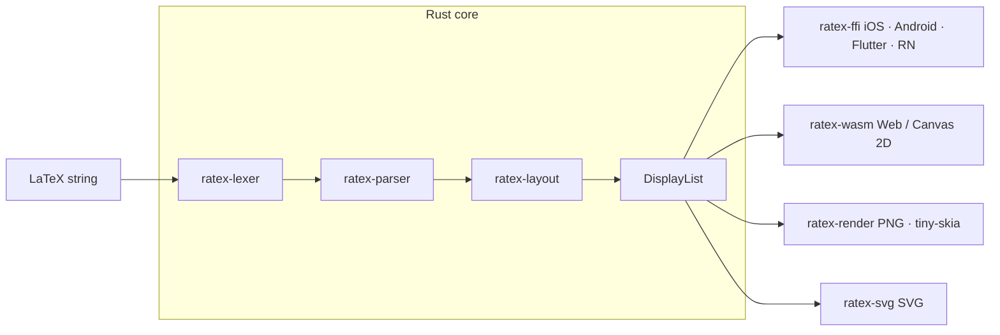

RaTeX is structured as a Cargo workspace of focused crates. A LaTeX string enters the pipeline at one end and a `DisplayList` — a flat, serializable list of drawing commands — exits at the other. Platform renderers consume the `DisplayList` independently; there is no shared rendering code between platforms.

## The rendering pipeline



Each stage is isolated in its own crate and depends only on the stages before it.

## Crate-by-crate breakdown

<AccordionGroup>
  <Accordion title="ratex-types — shared types">
    The base layer. Every other crate depends on this one. It defines the wire format that flows between the layout engine and all renderers.

    **Exports:**

    | Type | Description |
    |---|---|
    | `DisplayList` | The final output: dimensions + a `Vec<DisplayItem>` |
    | `DisplayItem` | A single drawing instruction (`GlyphPath`, `Line`, `Rect`, `Path`) |
    | `Color` | RGBA color value |
    | `PathCommand` | SVG-style path command (`MoveTo`, `LineTo`, `CurveTo`, `Close`) |
    | `MathStyle` | TeX style enum (`Display`, `Text`, `Script`, `ScriptScript` + cramped variants) |

    From `crates/ratex-types/src/lib.rs`:

    ```rust
    pub use color::Color;
    pub use display_item::{DisplayItem, DisplayList};
    pub use math_style::MathStyle;
    pub use path_command::PathCommand;
    ```
  </Accordion>

  <Accordion title="ratex-font — font metrics and symbol tables">
    Provides KaTeX-compatible font metrics and symbol lookup tables. The data files (`metrics_data.rs`, `symbols_data.rs`) are generated from KaTeX's JavaScript source using the scripts in `tools/`.

    ```
    crates/ratex-font/
    ├── src/
    │   ├── font_id.rs       # FontId enum
    │   ├── metrics.rs       # CharMetrics, math constants
    │   ├── symbols.rs       # Symbol lookup
    │   └── data/            # Generated — do not edit by hand
    │       ├── metrics_data.rs
    │       └── symbols_data.rs
    ```
  </Accordion>

  <Accordion title="ratex-lexer — LaTeX → token stream">
    Tokenizes a raw LaTeX string into a stream of tokens (commands, characters, delimiters, whitespace). This is the entry point for all input.
  </Accordion>

  <Accordion title="ratex-parser — token stream → AST">
    Converts the token stream into a `ParseNode` AST. Handles macro expansion, built-in function dispatch, and the full mhchem state machine for `\ce` and `\pu` chemistry notation.
  </Accordion>

  <Accordion title="ratex-layout — AST → DisplayList">
    The layout engine. Traverses the `ParseNode` AST, applies TeX box-and-glue layout rules, and calls `to_display_list` to produce a `DisplayList` with absolute coordinates. This is the most complex crate in the pipeline.
  </Accordion>

  <Accordion title="ratex-ffi — C ABI for native platforms">
    Exposes the full pipeline (`ratex-lexer` → `ratex-parser` → `ratex-layout`) over a C ABI. Used by iOS (static lib / XCFramework), Android (JNI), Flutter (Dart FFI), and React Native (native module).

    The primary entry point is `ratex_parse_and_layout`, which returns a heap-allocated JSON `DisplayList` string. Callers free it with `ratex_free_display_list`. Error details are available via `ratex_get_last_error`.

    On Android, the crate also includes a `jni` module that wraps the C ABI for the Kotlin bindings.
  </Accordion>

  <Accordion title="ratex-wasm — browser / Canvas 2D">
    Compiles the pipeline to WebAssembly and exports a single function:

    ```typescript
    renderLatex(latex: string): string // returns DisplayList JSON
    ```

    The `platforms/web` package consumes this, deserializes the JSON, and replays the drawing commands on a Canvas 2D context. The `<ratex-formula>` web component wraps this for drop-in HTML usage.
  </Accordion>

  <Accordion title="ratex-render — PNG via tiny-skia">
    Server-side rasterizer. Deserializes a `DisplayList` and replays drawing commands using [tiny-skia](https://github.com/RazrFalcon/tiny-skia), producing PNG output. Also ships a CLI binary that reads LaTeX from stdin.

    ```
    crates/ratex-render/
    ├── src/
    │   ├── main.rs        # CLI binary (stdin → PNGs)
    │   └── renderer.rs    # DisplayList → tiny-skia rasterize
    └── tests/
        └── golden_test.rs # Compares output/ vs fixtures/ (ink score)
    ```
  </Accordion>

  <Accordion title="ratex-svg — SVG export">
    Converts a `DisplayList` to an SVG string via `render_to_svg(list, opts)`.

    | Feature | Description |
    |---|---|
    | `standalone` | Embed glyph outlines as `<path>` using `ab_glyph` (requires KaTeX TTF files). Produces self-contained SVGs with no external font dependency. |
    | `cli` | Enables the `render-svg` binary (implies `standalone`). |

    `SvgOptions` fields: `font_size` (em units, default 40.0), `padding` (default 10.0), `stroke_width` (default 1.5), `embed_glyphs` (use `<path>` outlines), `font_dir` (KaTeX TTF directory).
  </Accordion>
</AccordionGroup>

## The DisplayList format

The `DisplayList` is the contract between the Rust core and all renderers. It serializes to JSON, making it usable over FFI, WASM, and any other language boundary.

```json
{
  "width": 3.14,
  "height": 1.2,
  "depth": 0.3,
  "items": [...]
}
```

From `crates/ratex-types/src/display_item.rs`:

```rust
/// The final output of the layout engine: a flat list of drawing commands
/// with absolute coordinates, ready for platform renderers.
#[derive(Debug, Clone, Serialize, Deserialize)]
pub struct DisplayList {
    pub items: Vec<DisplayItem>,
    pub width: f64,
    pub height: f64,
    pub depth: f64,
}
```

`total_height()` returns `height + depth` — the full vertical extent of the formula box.

## DisplayItem variants

Each item in the list is one of four drawing instructions:

```rust
#[derive(Debug, Clone, PartialEq, Serialize, Deserialize)]
#[serde(tag = "type")]
pub enum DisplayItem {
    /// Draw a glyph outline at the given position.
    GlyphPath {
        x: f64,
        y: f64,
        scale: f64,
        font: String,
        char_code: u32,
        #[serde(skip_serializing, default)]
        commands: Vec<PathCommand>,
        color: Color,
    },
    /// Draw a horizontal line (fraction bars, overlines, etc.).
    Line {
        x: f64,
        y: f64,
        width: f64,
        thickness: f64,
        color: Color,
        #[serde(default)]
        dashed: bool,
    },
    /// Draw a filled rectangle (\colorbox backgrounds).
    Rect {
        x: f64,
        y: f64,
        width: f64,
        height: f64,
        color: Color,
    },
    /// Draw an arbitrary SVG-style path (radical signs, large delimiters).
    Path {
        x: f64,
        y: f64,
        commands: Vec<PathCommand>,
        fill: bool,
        color: Color,
    },
}
```

| Variant | Used for |
|---|---|
| `GlyphPath` | Individual characters and math symbols |
| `Line` | Fraction bars, overlines, underlines, `\hdashline` |
| `Rect` | `\colorbox` backgrounds and filled regions |
| `Path` | Radical signs, stretchy delimiters, large operators |

<Note>
  The `commands` field on `GlyphPath` is skipped during JSON serialization to reduce payload size. Renderers draw glyphs using the `font` and `char_code` fields directly.
</Note>

## Coordinate system

All coordinates in a `DisplayList` are in **em units** relative to the formula's baseline.

- **Y increases downward** (screen coordinates).
- The **baseline** is at `y = height` within the formula's bounding box.
- `width` is the horizontal advance of the full formula.
- `height` is the distance from the baseline to the top of the box.
- `depth` is the distance from the baseline to the bottom of the box.

```
┌──────────────────────────────┐  ← y = 0 (top of bounding box)
│                              │
│       formula content        │  ← height (above baseline)
│                              │
╌──────────────────────────────╌  ← y = height (baseline)
│                              │
│    descenders / depth        │  ← depth (below baseline)
│                              │
└──────────────────────────────┘  ← y = height + depth
```

## MathStyle

`MathStyle` controls font sizes throughout the layout engine, following TeX's four main styles — Display (D), Text (T), Script (S), and ScriptScript (SS) — each with a cramped variant.

```rust
#[derive(Debug, Clone, Copy, PartialEq, Eq, Hash, Serialize, Deserialize, Default)]
pub enum MathStyle {
    #[default]
    Display,
    DisplayCramped,
    Text,
    TextCramped,
    Script,
    ScriptCramped,
    ScriptScript,
    ScriptScriptCramped,
}
```

Size multipliers match the TeX rules:

| Style | `size_multiplier()` |
|---|---|
| Display / Text | 1.0 |
| Script | 0.7 |
| ScriptScript | 0.5 |

Style transitions follow the KaTeX `Style.ts` lookup tables exactly. For example, the numerator of a fraction in Display style is set in Text style; the denominator is always cramped.

## Dependency graph

```
ratex-types  (base types: DisplayList, DisplayItem, Color, MathStyle, PathCommand)
    ↑
ratex-font   (KaTeX-compatible font metrics + symbol tables)
    ↑
ratex-lexer  (LaTeX string → token stream)
    ↑
ratex-parser (token stream → ParseNode AST; mhchem \ce / \pu)
    ↑
ratex-layout (AST → LayoutBox tree → DisplayList)
    ↑
    ├── ratex-ffi    (C ABI → iOS · Android · Flutter · React Native)
    ├── ratex-wasm   (WASM → browser / Canvas 2D)
    ├── ratex-render (PNG via tiny-skia)
    └── ratex-svg    (SVG vector output)
    ↑
platforms/   (ios · android · flutter · react-native · web)
```

Each leaf crate (`ratex-ffi`, `ratex-wasm`, `ratex-render`, `ratex-svg`) depends on `ratex-layout` and inherits the full stack transitively. The workspace `Cargo.toml` pins the shared version:

```toml
[workspace.package]
version = "0.0.15"
edition = "2021"
authors = ["RaTeX Contributors"]
license = "MIT"
```
