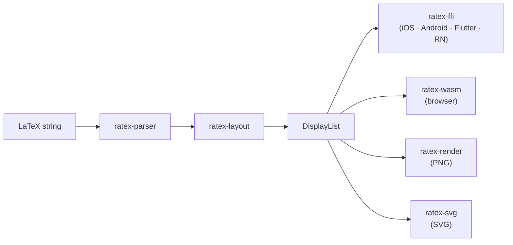

Every RaTeX render call produces a `DisplayList`: a flat array of typed drawing commands with absolute coordinates. This is the single output format shared across all platforms — iOS, Android, Flutter, React Native, Web, PNG, and SVG renderers all consume the same structure.



## JSON structure

When accessed via the C ABI (`ratex_parse_and_layout`) or WASM (`renderLatex`), the display list is returned as a UTF-8 JSON string with the following shape:

```json
{
  "width":  3.14,
  "height": 1.2,
  "depth":  0.3,
  "items":  [...]
}
```

<ResponseField name="width" type="number" required>
  Total width of the formula in em units. Multiply by `font_size` to get screen pixels.
</ResponseField>

<ResponseField name="height" type="number" required>
  Ascent above the baseline in em units. The total rendered height is `height + depth`.
</ResponseField>

<ResponseField name="depth" type="number" required>
  Descent below the baseline in em units. Subscripts, descenders, and the lower part of tall delimiters contribute to this value.
</ResponseField>

<ResponseField name="items" type="DisplayItem[]" required>
  Ordered array of drawing commands. Render them in order — later items paint over earlier ones.
</ResponseField>

## DisplayItem variants

Each item in `items` is a tagged object with a `type` field.

<AccordionGroup>
  <Accordion title="GlyphPath — draw a glyph">

Instructs the renderer to draw a single glyph from a named font at a given position.

```json
{
  "type": "GlyphPath",
  "x": 1.23,
  "y": 0.45,
  "scale": 1.0,
  "font": "KaTeX_Main-Regular",
  "char_code": 120,
  "color": { "r": 0.0, "g": 0.0, "b": 0.0, "a": 1.0 }
}
```

<ResponseField name="x" type="f64">
  Horizontal position of the glyph origin in em units.
</ResponseField>
<ResponseField name="y" type="f64">
  Vertical position of the glyph baseline in em units.
</ResponseField>
<ResponseField name="scale" type="f64">
  Scale factor relative to the base font size. Script and scriptscript sizes use values smaller than 1.0.
</ResponseField>
<ResponseField name="font" type="string">
  KaTeX font family name, e.g. `KaTeX_Main-Regular`, `KaTeX_Math-Italic`, `KaTeX_Size1-Regular`.
</ResponseField>
<ResponseField name="char_code" type="u32">
  Unicode code point of the glyph to render.
</ResponseField>
<ResponseField name="color" type="Color">
  RGBA color. Each channel is a 32-bit float in the range 0.0–1.0.
</ResponseField>

  </Accordion>
  <Accordion title="Line — draw a horizontal rule">

Used for fraction bars, overlines, underlines, and `\hdashline`.

```json
{
  "type": "Line",
  "x": 0.0,
  "y": 0.5,
  "width": 2.4,
  "thickness": 0.04,
  "dashed": false,
  "color": { "r": 0.0, "g": 0.0, "b": 0.0, "a": 1.0 }
}
```

<ResponseField name="x" type="f64">Left edge of the line.</ResponseField>
<ResponseField name="y" type="f64">Vertical position of the line center.</ResponseField>
<ResponseField name="width" type="f64">Length of the line.</ResponseField>
<ResponseField name="thickness" type="f64">Line weight in em units.</ResponseField>
<ResponseField name="dashed" type="bool" default="false">
  When `true`, render as a dashed line (used by `\hdashline`).
</ResponseField>
<ResponseField name="color" type="Color">RGBA color.</ResponseField>

  </Accordion>
  <Accordion title="Rect — draw a filled rectangle">

Used for `\colorbox` backgrounds and similar filled regions.

```json
{
  "type": "Rect",
  "x": 0.1,
  "y": 0.2,
  "width": 1.5,
  "height": 0.8,
  "color": { "r": 1.0, "g": 0.9, "b": 0.0, "a": 1.0 }
}
```

<ResponseField name="x" type="f64">Left edge of the rectangle.</ResponseField>
<ResponseField name="y" type="f64">Top edge of the rectangle.</ResponseField>
<ResponseField name="width" type="f64">Width of the rectangle.</ResponseField>
<ResponseField name="height" type="f64">Height of the rectangle.</ResponseField>
<ResponseField name="color" type="Color">Fill color.</ResponseField>

  </Accordion>
  <Accordion title="Path — draw an arbitrary outline">

Used for radical signs, large delimiters, and other shapes that cannot be drawn with simple primitives.

```json
{
  "type": "Path",
  "x": 0.0,
  "y": 0.0,
  "commands": [
    { "type": "MoveTo", "x": 0.0, "y": 1.0 },
    { "type": "LineTo", "x": 0.5, "y": 0.0 },
    { "type": "Close" }
  ],
  "fill": true,
  "color": { "r": 0.0, "g": 0.0, "b": 0.0, "a": 1.0 }
}
```

<ResponseField name="x" type="f64">X offset added to all path coordinates.</ResponseField>
<ResponseField name="y" type="f64">Y offset added to all path coordinates.</ResponseField>
<ResponseField name="commands" type="PathCommand[]">Sequence of path commands (see below).</ResponseField>
<ResponseField name="fill" type="bool">
  When `true`, fill the path interior. When `false`, stroke the outline only.
</ResponseField>
<ResponseField name="color" type="Color">Fill or stroke color.</ResponseField>

  </Accordion>
</AccordionGroup>

## PathCommand variants

Path commands follow the same semantics as SVG path data.

| Variant | Fields | Description |
|---|---|---|
| `MoveTo` | `x`, `y` | Move the current point without drawing. |
| `LineTo` | `x`, `y` | Draw a straight line to `(x, y)`. |
| `CubicTo` | `x1`, `y1`, `x2`, `y2`, `x`, `y` | Draw a cubic Bézier curve. `(x1,y1)` and `(x2,y2)` are control points; `(x,y)` is the end point. |
| `QuadTo` | `x1`, `y1`, `x`, `y` | Draw a quadratic Bézier curve. `(x1,y1)` is the control point; `(x,y)` is the end point. |
| `Close` | — | Close the current sub-path with a straight line back to the most recent `MoveTo`. |

## Color format

Colors are represented as an RGBA struct with four 32-bit float channels:

```json
{ "r": 0.2, "g": 0.6, "b": 1.0, "a": 1.0 }
```

Each channel is in the range 0.0–1.0. Alpha `1.0` is fully opaque; `0.0` is fully transparent.

## Coordinate system

<Info>
  All coordinates are in **em units**. Multiply by `font_size` (in points or pixels) to get screen coordinates.
</Info>

- **X** increases rightward from the left edge of the formula.
- **Y** increases downward from the top of the bounding box.
- The **baseline** is at `y = height` (the `height` field of the `DisplayList`).
- The total rendered height of the bounding box is `height + depth`.

## Custom renderer walkthrough

Iterating a `DisplayList` to draw on a custom canvas follows this pattern:

```rust
use ratex_types::{DisplayList, DisplayItem, PathCommand};

fn render(dl: &DisplayList, font_size: f64, canvas: &mut dyn Canvas) {
    for item in &dl.items {
        match item {
            DisplayItem::GlyphPath { x, y, scale, font, char_code, color, .. } => {
                let px = x * font_size;
                let py = y * font_size;
                canvas.draw_glyph(font, *char_code, px, py, scale * font_size, color);
            }
            DisplayItem::Line { x, y, width, thickness, color, dashed, .. } => {
                canvas.draw_line(
                    x * font_size,
                    y * font_size,
                    width * font_size,
                    thickness * font_size,
                    *dashed,
                    color,
                );
            }
            DisplayItem::Rect { x, y, width, height, color } => {
                canvas.fill_rect(
                    x * font_size, y * font_size,
                    width * font_size, height * font_size,
                    color,
                );
            }
            DisplayItem::Path { x, y, commands, fill, color } => {
                let mut path = canvas.new_path();
                for cmd in commands {
                    match cmd {
                        PathCommand::MoveTo { x: cx, y: cy } =>
                            path.move_to((x + cx) * font_size, (y + cy) * font_size),
                        PathCommand::LineTo { x: cx, y: cy } =>
                            path.line_to((x + cx) * font_size, (y + cy) * font_size),
                        PathCommand::CubicTo { x1, y1, x2, y2, x: cx, y: cy } =>
                            path.cubic_to(
                                (x + x1) * font_size, (y + y1) * font_size,
                                (x + x2) * font_size, (y + y2) * font_size,
                                (x + cx) * font_size, (y + cy) * font_size,
                            ),
                        PathCommand::QuadTo { x1, y1, x: cx, y: cy } =>
                            path.quad_to(
                                (x + x1) * font_size, (y + y1) * font_size,
                                (x + cx) * font_size, (y + cy) * font_size,
                            ),
                        PathCommand::Close => path.close(),
                    }
                }
                if *fill { canvas.fill_path(&path, color); }
                else     { canvas.stroke_path(&path, color); }
            }
        }
    }
}
```

## Next steps

<CardGroup cols={2}>
  <Card title="SVG export" icon="vector-square" href="/output/svg">
    See how ratex-svg consumes a DisplayList to produce SVG output.
  </Card>
  <Card title="PNG export" icon="image" href="/output/png">
    See how ratex-render consumes a DisplayList to produce PNG output.
  </Card>
</CardGroup>
