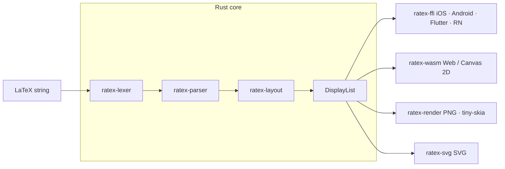

RaTeX takes a LaTeX string and produces a platform-native rendering on iOS, Android, Flutter, React Native, the Web (WASM), or as a PNG/SVG file — all from one Rust core.

```
\frac{-b \pm \sqrt{b^2-4ac}}{2a}   →   iOS · Android · Flutter · React Native · Web · PNG · SVG
```

## Why RaTeX?

Every major cross-platform math renderer today runs LaTeX through a browser or JavaScript engine — a hidden WebView consuming 50–150 MB of RAM, startup latency before the first formula, and no offline guarantee.

RaTeX cuts the web stack out entirely. The pipeline runs in pure Rust: no GC, no V8, no DOM.

| | KaTeX (web) | MathJax | **RaTeX** |
|---|---|---|---|
| Runtime | V8 + DOM | V8 + DOM | **Pure Rust** |
| Mobile | WebView | WebView | **Native** |
| Offline | Depends | Depends | **Yes** |
| Bundle overhead | ~280 kB JS | ~500 kB JS | **0 kB JS** |
| Memory | GC / heap | GC / heap | **Predictable** |
| Syntax coverage | 100% | ~100% | **~99%** |

## What it renders

**Math** — ~99% of KaTeX syntax: fractions, radicals, integrals, matrices, environments, stretchy delimiters, and more.

**Chemistry** — full mhchem support via `\ce` and `\pu`:

```latex
\ce{H2SO4 + 2NaOH -> Na2SO4 + 2H2O}
\ce{Fe^{2+} + 2e- -> Fe}
\pu{1.5e-3 mol//L}
```

**Physics units** — `\pu` for value + unit expressions following IUPAC conventions.

## Platform targets

<CardGroup cols={2}>
  <Card title="iOS" icon="apple" href="/platforms/ios">
    XCFramework + Swift / CoreGraphics. Distributed via Swift Package Manager.
  </Card>
  <Card title="Android" icon="android" href="/platforms/android">
    JNI + Kotlin + Canvas. Distributed as an AAR via Maven Central.
  </Card>
  <Card title="Flutter" icon="flutter" href="/platforms/flutter">
    Dart FFI + `CustomPainter`. Published to pub.dev.
  </Card>
  <Card title="React Native" icon="react" href="/platforms/react-native">
    Native module + C ABI. iOS and Android views included.
  </Card>
  <Card title="Web (WASM)" icon="globe" href="/platforms/web">
    WASM → Canvas 2D. `<ratex-formula>` web component via npm.
  </Card>
  <Card title="Server / PNG" icon="server" href="/quickstart">
    tiny-skia PNG rasterizer. Runs in CI or as a CLI tool.
  </Card>
  <Card title="SVG" icon="vector-square" href="/quickstart">
    Self-contained vector SVG with optional embedded glyph outlines.
  </Card>
  <Card title="Architecture" icon="diagram-project" href="/architecture">
    Learn how the Rust core pipeline works end to end.
  </Card>
</CardGroup>

## How it works

One Rust core computes a `DisplayList` — a flat list of drawing commands with absolute coordinates. Each platform renderer receives this list and draws natively, with no shared rendering code between platforms.



See the [Architecture](/architecture) page for a full crate-by-crate breakdown.

## Acknowledgements

RaTeX owes a great debt to [KaTeX](https://katex.org/) — its parser architecture, symbol tables, font metrics, and layout semantics are the foundation of this engine. Chemistry notation (`\ce`, `\pu`) is powered by a Rust port of the [mhchem](https://mhchem.github.io/MathJax-mhchem/) state machine.
